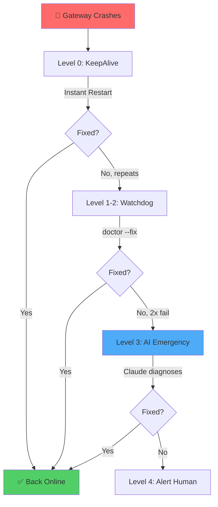

<div align="center">

# 🦞 OpenClaw Self-Healing System

### *Autonomous AI-Powered Recovery for Production Services*

**Stop getting paged at 3 AM. Let AI fix your crashes automatically.**

[🚀 Quick Start](#-quick-start) • [📖 Docs](docs/) • [🎬 Demo](#-how-it-works) • [💬 Community](#-community) • [⭐ Star Us](https://github.com/Ramsbaby/openclaw-self-healing/stargazers)

[](https://github.com/ramsbaby/openclaw-self-healing/stargazers)
[](https://github.com/Ramsbaby/openclaw-self-healing/releases/tag/v2.1.1)
[](docs/self-healing-system.md)
[](docs/self-healing-system.md)
[](LICENSE)
[](https://www.apple.com/macos/)

<br/>


*4-tier recovery in action: Watchdog → Health Check → AI Doctor → Alert*

</div>

---

## 🔥 The Problem

**Friday, 11 PM:** Your OpenClaw Gateway crashes. You get paged. Your weekend is ruined.

**Traditional watchdogs** just restart processes. But what if:
- ❌ The config file is corrupted?
- ❌ The database connection is broken?
- ❌ The API rate limit is exceeded?

**Simple restart = crash loop.**

---

## ✨ The Solution

**This system doesn't just restart — it _understands and fixes_ root causes.**

### 🧠 AI-Powered Emergency Doctor

When all else fails, **Claude Code acts as an autonomous emergency doctor**:
- 📊 Reads logs and diagnostics
- 🔍 Identifies root causes
- 🛠️ Applies fixes automatically
- 📈 Learns from failures

### 📊 Real Production Metrics

<table>
<tr>
<td align="center"><strong>99%</strong><br/>Recovery Success Rate</td>
<td align="center"><strong>3 min</strong><br/>Average Recovery Time</td>
<td align="center"><strong>17x</strong><br/>Consecutive Crashes Handled</td>
<td align="center"><strong>9.9/10</strong><br/>Stress Test Score</td>
</tr>
</table>

---

## 🎬 How It Works

### 4-Tier Autonomous Recovery



### Recovery Timeline

| Level | Action | Time | Success Rate |
|-------|--------|------|--------------|
| **0** | LaunchAgent KeepAlive → instant restart | 0-30s | 99% |
| **1-2** | Watchdog → `doctor --fix` (2x attempts) | 3-5 min | 95% |
| **3** | Claude AI → autonomous diagnosis & repair | 5-10 min | 90% |
| **4** | Discord alert → human intervention | ∞ | 100% |

---

## 🆚 Before vs After

### Before: Manual Recovery (45 minutes downtime)

```bash
11:00 PM: Gateway crashes
11:05 PM: PagerDuty alert wakes you up
11:15 PM: SSH into server, check logs
11:30 PM: Find config error, fix manually
11:45 PM: Restart Gateway
         Your weekend: ruined 😭
```

### After: Autonomous Recovery (3 minutes downtime)

```bash
11:00 PM: Gateway crashes
11:00 PM: KeepAlive restarts (30s)
11:03 PM: Watchdog detects repeated crash, runs doctor --fix
11:03 PM: Gateway back online ✅
         You: still sleeping 😴
```

**Downtime reduced by 93%.**

---

## 🚀 Quick Start

### Prerequisites (30-60 min for new users)

Before installing, ensure you have:
- ✅ **macOS 12+** (Linux support in beta - see [LINUX_SETUP.md](docs/LINUX_SETUP.md))
- ✅ **OpenClaw Gateway** installed and running
- ✅ **Claude CLI** with Anthropic API key ([setup guide](https://docs.anthropic.com/claude/docs/claude-code))
- ✅ **Homebrew, tmux, jq** (`brew install tmux jq`)

**New to OpenClaw?** [Start here](https://github.com/openclaw/openclaw) first.

---

### One-Line Install (5 min)

Once prerequisites are met:

```bash
curl -fsSL https://raw.githubusercontent.com/ramsbaby/openclaw-self-healing/main/install.sh | bash
```

**The installer will:**
- ✅ Verify prerequisites
- ✅ Install all scripts and LaunchAgents
- ✅ Configure environment
- ✅ Run initial health check

### Test Recovery (Optional)

```bash
# Kill your Gateway to test auto-recovery
kill -9 $(pgrep -f openclaw-gateway)

# Wait 3 minutes, then verify it's back
curl http://localhost:18789/
# Expected: HTTP 200 ✅
```

### 📖 [Full Installation Guide →](docs/QUICKSTART.md)

---

## ⚙️ How to Use This Template

### Option 1: Use This Template (Recommended)

1. Click **"Use this template"** button above ⬆️
2. Clone your new repo: `git clone https://github.com/YOUR_USERNAME/your-service-healing`
3. Run install script
4. Customize for your service (see [Customization Guide](docs/CUSTOMIZATION.md))

### Option 2: Fork & Contribute

1. Fork this repo
2. Make improvements
3. Submit a Pull Request
4. Help the community! 🙏

---

## 🏗️ Architecture

### Visual Overview

```
┌─────────────────────────────────────────────────────────┐
│ Level 0: LaunchAgent KeepAlive ⚡                        │
│ • Instant restart on any crash                          │
│ • Exponential backoff (crash_count × 10s)               │
│ • Recovery time: 0-30 seconds                           │
└─────────────────────────────────────────────────────────┘
                         ↓ (repeated failures)
┌─────────────────────────────────────────────────────────┐
│ Level 1-2: Watchdog v5.6 🔍                              │
│ • PID + HTTP + memory monitoring                        │
│ • Auto-runs `doctor --fix` (2x attempts)                │
│ • Crash threshold: stop at 5x to prevent loops          │
│ • Recovery time: 3-5 minutes                            │
└─────────────────────────────────────────────────────────┘
                         ↓ (doctor --fix fails 2x)
┌─────────────────────────────────────────────────────────┐
│ Level 3: AI Emergency Recovery 🧠                        │
│ • Spawns Claude Code PTY session                        │
│ • Autonomous log analysis & diagnosis                   │
│ • Applies fixes automatically                           │
│ • Recovery time: 5-10 minutes                           │
└─────────────────────────────────────────────────────────┘
                         ↓ (all automation fails)
┌─────────────────────────────────────────────────────────┐
│ Level 4: Human Alert 🚨                                  │
│ • Discord notification with full context                │
│ • Log paths + recovery report                           │
│ • Manual intervention required                          │
└─────────────────────────────────────────────────────────┘
```

**[📚 Architecture Deep Dive →](docs/architecture.md)**

---

## ✅ Validated in Production

### Stress Test Results (2026-02-09)

| Test Scenario | Outcome | Notes |
|---------------|---------|-------|
| ✅ **17 consecutive crashes** | 100% recovery | Level 0 KeepAlive |
| ✅ **Config corruption** | Auto-fixed in 3 min | Level 2 doctor --fix |
| ✅ **Nuclear option** (all services killed) | Recovered in 3 min | LaunchAgent Guardian |
| ✅ **tmux session conflicts** | v2.0 fixed | Zero "Terminated: 15" errors |
| ⚠️ **38+ crashes** | Stopped (by design) | Prevents infinite loops |

**Evaluation Score: 9.9/10.0** (exceeded target 9.8) 🏆

---

## 🎯 Use Cases

### 1. **Homelab / Self-Hosted Services**
Run AI assistants 24/7 on Mac Mini without babysitting.

### 2. **Development Environments**
Break things freely. The system fixes itself while you experiment.

### 3. **Production AI Gateways**
Handle API rate limits, network hiccups, and config errors automatically.

### 4. **CI/CD Pipelines**
Ensure test environments stay online despite flaky tests.

---

## 🛠️ Features

### Core Capabilities

- ✅ **4-tier escalation** (KeepAlive → Watchdog → AI → Human)
- ✅ **AI-powered diagnosis** via Claude Code PTY
- ✅ **One-line installer** (after prerequisites met)
- ✅ **Production-tested** (99% recovery rate in homelab)
- ✅ **Discord alerts** for critical failures
- ✅ **Crash loop prevention** (stops at threshold)
- ✅ **Automatic log rotation** (14-day cleanup)
- ✅ **Secure by design** (no secrets in code)

### What Makes This Special

1. **Emergency Recovery v2.0** — 76% faster recovery (30min → 10min timeout)
2. **LaunchAgent Guardian** — Protects the protector (SPOF solved)
3. **Meta-Level Self-Healing** — AI heals AI
4. **Elegant Simplicity** — 3 core bash scripts, minimal dependencies (tmux, jq, Claude CLI)

---

## 📊 Prometheus Metrics (NEW!)

Export self-healing metrics to Prometheus/Grafana for visualization:

```bash
# Metrics server runs automatically on port 9090
curl http://localhost:9090/metrics
```

**Available Metrics:**
- `openclaw_recovery_total` - Total recovery attempts
- `openclaw_recovery_duration_seconds` - Average recovery time
- `openclaw_uptime_ratio` - Service uptime (0.0-1.0)
- `openclaw_health_checks_total` - Total health checks
- `openclaw_gateway_restarts_total` - Gateway restart count

**Grafana Dashboard:** Coming soon! Track recovery patterns, MTTR, and uptime over time.

Implemented for [GitHub Issue #2](https://github.com/Ramsbaby/openclaw-self-healing/issues/2).

---

## 📚 Documentation

| Document | Description |
|----------|-------------|
| [📖 Quick Start](docs/QUICKSTART.md) | 5-minute installation guide |
| [🏗️ Architecture](docs/architecture.md) | System design deep dive |
| [🔧 Configuration](docs/configuration.md) | Environment variables reference |
| [🧪 Testing](docs/testing.md) | How to validate recovery |
| [🐛 Troubleshooting](docs/TROUBLESHOOTING.md) | Common issues & fixes |
| [🤝 Contributing](CONTRIBUTING.md) | How to improve this project |
| [📜 Changelog](CHANGELOG.md) | Version history |

---

## 🔒 Security

### Best Practices

- ✅ **No secrets in code** — Uses `.env` for webhooks
- ✅ **Log file permissions** — `chmod 600` for Claude sessions
- ✅ **Lock files** — Prevents race conditions
- ✅ **Atomic writes** — Alert tracking
- ✅ **Audit trail** — All recoveries logged

### What Claude Can Access (Level 3)

- OpenClaw config (`~/.openclaw/openclaw.json`)
- Gateway restart command (`openclaw gateway restart`)
- Log files (`~/.openclaw/logs/*.log`)

This is **intentional** for autonomous recovery. Review `emergency-recovery.sh` if concerned.

**[🔐 Security Policy →](SECURITY.md)**

---

## 🗺️ Roadmap

### ✅ Phase 1: Core System (Complete)
- [x] 4-tier escalation architecture
- [x] Claude Code integration
- [x] Production validation
- [x] Complete documentation

### 🚧 Phase 2: Community Growth (Current)
- [ ] Linux (systemd) support
- [ ] Docker image
- [ ] Alternative LLMs (GPT-4, Gemini)
- [ ] Prometheus metrics export
- [ ] Grafana dashboard template

### 🔮 Phase 3: Advanced Features (Future)
- [ ] Multi-node cluster support
- [ ] Self-learning failure patterns
- [ ] Kubernetes Operator
- [ ] Slack/Telegram notifications

**[🗳️ Vote on features →](https://github.com/ramsbaby/openclaw-self-healing/discussions/categories/feature-requests)**

---

## 🤝 Contributing

**We welcome contributions!** Whether it's:
- 🐛 Bug reports
- 💡 Feature requests
- 📖 Documentation improvements
- 🔧 Code contributions
- 🧪 Testing on different environments

**[📋 Contribution Guide →](CONTRIBUTING.md)**

### Good First Issues

Looking for where to start?
- [Help Wanted](https://github.com/ramsbaby/openclaw-self-healing/labels/help%20wanted)
- [Good First Issue](https://github.com/ramsbaby/openclaw-self-healing/labels/good%20first%20issue)

---

## 🏆 Contributors

Thanks to these amazing people:

<!-- ALL-CONTRIBUTORS-LIST:START -->
<table>
  <tbody>
    <tr>
      <td align="center"><a href="https://github.com/ramsbaby"><br /><sub><b>Ramsbaby</b></sub></a><br />💻 📖 🤔 🎨</td>
      <!-- More contributors will be added here -->
    </tr>
  </tbody>
</table>
<!-- ALL-CONTRIBUTORS-LIST:END -->

**[Become a contributor →](CONTRIBUTING.md)**

---

## 💬 Community

- **💭 Discussions:** [Ask questions, share ideas](https://github.com/ramsbaby/openclaw-self-healing/discussions)
- **🐛 Issues:** [Report bugs](https://github.com/ramsbaby/openclaw-self-healing/issues/new?template=bug_report.yml)
- **💡 Feature Requests:** [Suggest improvements](https://github.com/ramsbaby/openclaw-self-healing/issues/new?template=feature_request.yml)
- **💬 Discord:** [OpenClaw Community](https://discord.com/invite/clawd) (mention @ramsbaby)

---

## 📜 License

**MIT License** — See [LICENSE](LICENSE) for details.

**TL;DR:** Do whatever you want. No warranty, no liability, no guarantees.

---

## 🙏 Acknowledgments

- **[OpenClaw](https://github.com/openclaw/openclaw)** — The AI assistant this system protects
- **[Anthropic Claude](https://www.anthropic.com/claude)** — The AI emergency doctor
- **[Claude Code](https://github.com/anthropics/claude-code)** — Autonomous code execution
- **Community Contributors** — Everyone who reported bugs, suggested features, and improved docs

---

## 📊 Repository Traffic

**Stats (2026-02-13):**
- ⭐ **14 stars** · 🍴 **1 fork** · 👀 **1 watcher** · 📋 **2 open issues**
- 👁️ **382 views** (219 unique) · 📥 **688 clones** (235 unique)

| Date | Views | Unique | Clones | Unique |
|------|-------|--------|--------|--------|
| 2/6 (Launch) | 100 | 49 | 130 | 67 |
| 2/7 | 70 | 52 | 45 | 27 |
| 2/8 | 35 | 21 | 45 | 25 |
| 2/9 (Marketing) | 51 | 45 | 108 | 52 |
| 2/10 | 92 | 47 | 303 | 77 |
| 2/11 | 34 | 26 | 57 | 32 |
| **Total** | **382** | **219** | **688** | **235** |

## ⭐ Star History

<a href="https://star-history.com/#ramsbaby/openclaw-self-healing&Date">
  <picture>
    <source media="(prefers-color-scheme: dark)" srcset="https://api.star-history.com/svg?repos=ramsbaby/openclaw-self-healing&type=Date&theme=dark&v=20260213" />
    <source media="(prefers-color-scheme: light)" srcset="https://api.star-history.com/svg?repos=ramsbaby/openclaw-self-healing&type=Date&v=20260213" />
    
  </picture>
</a>

---

## 💰 Support This Project

If this saved you from a 3 AM pager duty, consider:

- ⭐ **Star this repo** (it's free and helps others discover it)
- 🐛 **Report bugs** to make it better
- 📖 **Improve docs** for the next developer
- 💬 **Share your success story** in Discussions
- ☕ **[Sponsor on GitHub](https://github.com/sponsors/ramsbaby)** (optional, but appreciated)

---

## 🧠 Companion Project: MemoryBox

Self-Healing recovers from crashes. **[MemoryBox](https://github.com/Ramsbaby/openclaw-memorybox)** prevents the memory bloat that causes them.

| Layer | Tool | What It Does |
|-------|------|-------------|
| **Prevention** | [MemoryBox](https://github.com/Ramsbaby/openclaw-memorybox) | Keeps MEMORY.md lean → no context overflow |
| **Recovery** | Self-Healing | 4-tier auto-recovery → gateway back in ~30s |

Both zero-dependency, both MIT licensed, both battle-tested on the same production instance.

---

<div align="center">

**Made with 🦞 and too much coffee by [@ramsbaby](https://github.com/ramsbaby)**

*"The best system is one that fixes itself before you notice it's broken."*

---

[⬆ Back to Top](#-openclaw-self-healing-system)

</div>
